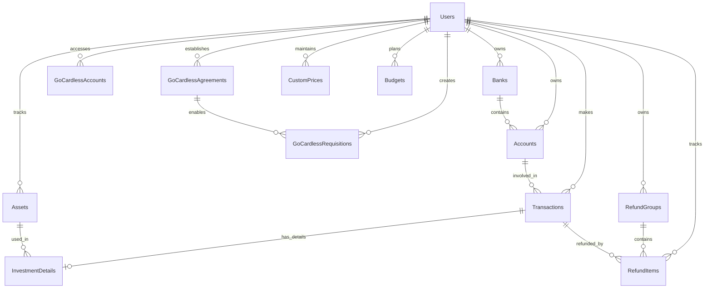

# 📚 Database Structure Documentation

This document outlines the database schema for the WealthManager application. The database is designed to efficiently manage personal financial data while maintaining relationships between different entities.

## 🏗 Schema Overview

### 👤 Users Table

Primary table for user management and authentication.

| Field | Type | Description | Constraints |
|-------|------|-------------|-------------|
| `id` | INTEGER | Unique identifier | PRIMARY KEY, AUTOINCREMENT |
| `name` | TEXT | User's full name | NOT NULL |
| `email` | TEXT | User's email address | UNIQUE, NOT NULL |
| `password` | TEXT | Encrypted password | NOT NULL |
| `last_login` | TIMESTAMP | Last login timestamp | |

### 🏦 Banks Table

Stores information about financial institutions.

| Field | Type | Description | Constraints |
|-------|------|-------------|-------------|
| `id` | INTEGER | Unique identifier | PRIMARY KEY, AUTOINCREMENT |
| `user_id` | INTEGER | Reference to user | FOREIGN KEY, NOT NULL |
| `name` | TEXT | Bank's name | NOT NULL |
| `website` | TEXT | Bank's website | |

### 💰 Accounts Table

Manages different types of financial accounts.

| Field | Type | Description | Constraints |
|-------|------|-------------|-------------|
| `id` | INTEGER | Unique identifier | PRIMARY KEY, AUTOINCREMENT |
| `user_id` | INTEGER | Reference to user | FOREIGN KEY, NOT NULL |
| `name` | TEXT | Account name | NOT NULL |
| `type` | TEXT | Account type | CHECK(type IN ('investment', 'income', 'expense', 'checking', 'savings')), NOT NULL |
| `bank_id` | INTEGER | Reference to bank | FOREIGN KEY, NOT NULL |

### 💸 Transactions Table

Records all financial transactions.

| Field | Type | Description | Constraints |
|-------|------|-------------|-------------|
| `id` | INTEGER | Unique identifier | PRIMARY KEY, AUTOINCREMENT |
| `user_id` | INTEGER | Reference to user | FOREIGN KEY, NOT NULL |
| `date` | TIMESTAMP | Transaction date | NOT NULL |
| `date_accountability` | TIMESTAMP | Accountability date | NOT NULL |
| `description` | TEXT | Transaction description | NOT NULL |
| `amount` | DECIMAL(10,2) | Transaction amount | NOT NULL, CHECK (amount > 0) |
| `from_account_id` | INTEGER | Source account | FOREIGN KEY, NOT NULL |
| `to_account_id` | INTEGER | Destination account | FOREIGN KEY, NOT NULL |
| `category` | TEXT | Transaction category | NOT NULL |
| `subcategory` | TEXT | Transaction subcategory | |
| `type` | TEXT | Transaction type | CHECK(type IN ('expense', 'income', 'transfer')), NOT NULL |
| `is_investment` | BOOLEAN | Whether transaction is an investment | DEFAULT FALSE |

### 📈 Assets Table

Stores information about investment assets.

| Field | Type | Description | Constraints |
|-------|------|-------------|-------------|
| `id` | INTEGER | Unique identifier | PRIMARY KEY, AUTOINCREMENT |
| `user_id` | INTEGER | Reference to user | FOREIGN KEY, NOT NULL |
| `symbol` | TEXT | Asset symbol | NOT NULL |
| `name` | TEXT | Asset name | NOT NULL |

_Note: The combination of `(symbol, user_id)` must be unique._

### 💹 Investment Details Table

Records details for investment transactions.

| Field | Type | Description | Constraints |
|-------|------|-------------|-------------|
| `transaction_id` | INTEGER | Reference to transaction | PRIMARY KEY, FOREIGN KEY |
| `asset_id` | INTEGER | Reference to asset | FOREIGN KEY, NOT NULL |
| `quantity` | DECIMAL(10,6) | Number of units | NOT NULL |
| `unit_price` | DECIMAL(10,2) | Price per unit | NOT NULL |
| `fee` | DECIMAL(10,2) | Transaction fee | NOT NULL |
| `tax` | DECIMAL(10,2) | Transaction tax | NOT NULL |
| `total_paid` | DECIMAL(10,2) | Total amount paid | |
| `investment_type` | TEXT | Type of investment activity | CHECK(investment_type IN ('Buy', 'Sell', 'Dividend', 'Interest', 'Deposit', 'Withdrawal')), NOT NULL |

### 📊 Stock Cache Table

Caches stock information for faster access.

| Field | Type | Description | Constraints |
|-------|------|-------------|-------------|
| `symbol` | TEXT | Asset symbol | NOT NULL |
| `cache_type` | TEXT | Type of cached data | NOT NULL |
| `data` | TEXT | Cached data (JSON) | NOT NULL |
| `last_updated` | TEXT | When cache was last updated | NOT NULL |

_Note: The combination of `(symbol, cache_type)` is the primary key._

### 💵 Refund Groups Table

Organizes refund items into logical groups.

| Field | Type | Description | Constraints |
|-------|------|-------------|-------------|
| `id` | INTEGER | Unique identifier | PRIMARY KEY, AUTOINCREMENT |
| `user_id` | INTEGER | Reference to user | FOREIGN KEY, NOT NULL |
| `name` | TEXT | Group name | NOT NULL |
| `description` | TEXT | Group description | |

### 💵 Refund Items Table

Tracks refunds for expenses.

| Field | Type | Description | Constraints |
|-------|------|-------------|-------------|
| `id` | INTEGER | Unique identifier | PRIMARY KEY, AUTOINCREMENT |
| `user_id` | INTEGER | Reference to user | FOREIGN KEY, NOT NULL |
| `income_transaction_id` | INTEGER | Reference to income transaction | FOREIGN KEY, NOT NULL |
| `expense_transaction_id` | INTEGER | Reference to expense transaction | FOREIGN KEY, NOT NULL |
| `amount` | REAL | Refund amount | NOT NULL |
| `refund_group_id` | INTEGER | Reference to refund group | FOREIGN KEY |
| `description` | TEXT | Refund description | |

### 🔄 GoCardless Requisitions Table

Manages GoCardless API requisitions.

| Field | Type | Description | Constraints |
|-------|------|-------------|-------------|
| `requisition_id` | TEXT | Requisition identifier | PRIMARY KEY |
| `link` | TEXT | Requisition link | NOT NULL |
| `user_id` | INTEGER | Reference to user | FOREIGN KEY, NOT NULL |
| `institution_id` | TEXT | Institution identifier | NOT NULL |
| `reference` | TEXT | Reference | |
| `agreement_id` | TEXT | Reference to agreement | FOREIGN KEY |
| `created_at` | TIMESTAMP | Creation timestamp | DEFAULT CURRENT_TIMESTAMP |

### 🔄 GoCardless Accounts Table

Stores GoCardless account information.

| Field | Type | Description | Constraints |
|-------|------|-------------|-------------|
| `account_id` | TEXT | Account identifier | PRIMARY KEY |
| `created_at` | TEXT | Creation timestamp | NOT NULL |
| `last_accessed` | TEXT | Last access timestamp | NOT NULL |
| `iban` | TEXT | IBAN | |
| `institution_id` | TEXT | Institution identifier | NOT NULL |
| `status` | TEXT | Account status | |
| `owner_name` | TEXT | Account owner name | |
| `currency` | TEXT | Account currency | |
| `balance` | REAL | Account balance | |
| `account_type` | TEXT | Account type | |
| `user_id` | INTEGER | Reference to user | FOREIGN KEY, NOT NULL |

### 🔄 GoCardless Cache Table

Caches GoCardless data for faster access.

| Field | Type | Description | Constraints |
|-------|------|-------------|-------------|
| `cache_key` | TEXT | Cache key | NOT NULL |
| `cache_type` | TEXT | Type of cached data | NOT NULL |
| `data` | TEXT | Cached data (JSON) | NOT NULL |
| `last_updated` | TEXT | When cache was last updated | NOT NULL |

_Note: The combination of `(cache_key, cache_type)` is the primary key._

### 🔄 GoCardless Agreements Table

Manages agreements with GoCardless institutions.

| Field | Type | Description | Constraints |
|-------|------|-------------|-------------|
| `agreement_id` | TEXT | Agreement identifier | PRIMARY KEY |
| `institution_id` | TEXT | Institution identifier | NOT NULL |
| `max_historical_days` | INTEGER | Maximum days of historical data | NOT NULL |
| `access_valid_for_days` | INTEGER | Days the access is valid | NOT NULL |
| `access_scope` | TEXT | Scope of access | NOT NULL |
| `user_id` | INTEGER | Reference to user | FOREIGN KEY, NOT NULL |
| `created_at` | TEXT | Creation timestamp | NOT NULL |

### 💹 Custom Prices Table

Stores custom price data for assets.

| Field | Type | Description | Constraints |
|-------|------|-------------|-------------|
| `id` | INTEGER | Unique identifier | PRIMARY KEY, AUTOINCREMENT |
| `symbol` | TEXT | Asset symbol | NOT NULL |
| `date` | TEXT | Price date | NOT NULL |
| `open` | DECIMAL(10,4) | Opening price | NOT NULL |
| `high` | DECIMAL(10,4) | Highest price | NOT NULL |
| `low` | DECIMAL(10,4) | Lowest price | NOT NULL |
| `close` | DECIMAL(10,4) | Closing price | NOT NULL |
| `volume` | INTEGER | Trading volume | DEFAULT 0 |
| `created_at` | TEXT | Creation timestamp | NOT NULL |
| `updated_at` | TEXT | Update timestamp | NOT NULL |
| `user_id` | INTEGER | Reference to user | FOREIGN KEY, NOT NULL |

### 📋 Budgets Table

Manages budget amounts for categories.

| Field | Type | Description | Constraints |
|-------|------|-------------|-------------|
| `id` | INTEGER | Unique identifier | PRIMARY KEY, AUTOINCREMENT |
| `user_id` | INTEGER | Reference to user | FOREIGN KEY, NOT NULL |
| `category` | TEXT | Budget category | NOT NULL |
| `amount` | DECIMAL(10,2) | Budget amount | NOT NULL, CHECK (amount > 0) |
| `start_date` | TIMESTAMP | Budget start date | NOT NULL |
| `created_at` | TIMESTAMP | Creation timestamp | DEFAULT CURRENT_TIMESTAMP |
| `updated_at` | TIMESTAMP | Update timestamp | DEFAULT CURRENT_TIMESTAMP |

## 📊 Views

### account_balances

Calculates current balance for each account based on all transactions.

This view:
- Shows account details including ID, user ID, name, and type
- Calculates the current balance by summing all transaction impacts
- When an account is the source (from_account_id), the amount is subtracted
- When an account is the destination (to_account_id), the amount is added

### asset_balances

Tracks the current balance of assets owned by users.

This view:
- Shows user ID, asset ID, symbol, and name
- Calculates the total quantity of each asset owned
- Takes into account Buy/Deposit (positive) and Sell/Withdrawal (negative) transactions
- Only includes assets with positive quantities
- Shows the date of the last transaction for each asset

### asset_balances_by_account

Tracks asset balances per account.

This view:
- Shows user ID, account ID, account name, account type, asset ID, symbol, and asset name
- Calculates the quantity of each asset in each account
- Takes into account Buy/Deposit (positive) and Sell/Withdrawal (negative) transactions
- Only includes assets with positive quantities
- Shows the date of the last transaction for each asset in each account

## 🔫 Triggers

### trg_validate_transaction

Validates transaction types and account combinations before insertion.

This trigger ensures:
- Income transactions:
  - Can only be received in checking, savings, or investment accounts
  - Must originate from an income account
- Expense transactions:
  - Can only be paid from checking, savings, or investment accounts
  - Must go to an expense account
- Transfer transactions:
  - Can only occur between checking, savings, or investment accounts

### trg_validate_account_bank_ownership_insert

Ensures account creation is only allowed with banks owned by the same user.

### trg_validate_account_bank_ownership_update

Ensures account updates only use banks owned by the same user.

### trg_validate_transaction_account_ownership_insert

Ensures transaction creation only uses accounts owned by the same user.

### trg_validate_transaction_account_ownership_update

Ensures transaction updates only use accounts owned by the same user.

## 🔗 Entity Relationships

## 🔐 Data Integrity

1. **Foreign Key Constraints**
   - All relationships are enforced with ON DELETE CASCADE
   - Ensures referential integrity across all tables

2. **Type Validations**
   - Account types: 'investment', 'income', 'expense', 'checking', 'savings'
   - Transaction types: 'expense', 'income', 'transfer'
   - Investment types: 'Buy', 'Sell', 'Dividend', 'Interest', 'Deposit', 'Withdrawal'

3. **Triggers**
   - Validates transaction types and account combinations
   - Enforces ownership rules for banks, accounts and transactions
   - Ensures proper data integrity across related entities

4. **Indexes**
   - On users' email for fast authentication
   - On banks and accounts by user_id for quick access
   - On transactions by user_id and date for efficient filtering
   - On GoCardless entities by user_id and institution_id for quick lookups
   - On budgets by user_id and category for efficient budget tracking
