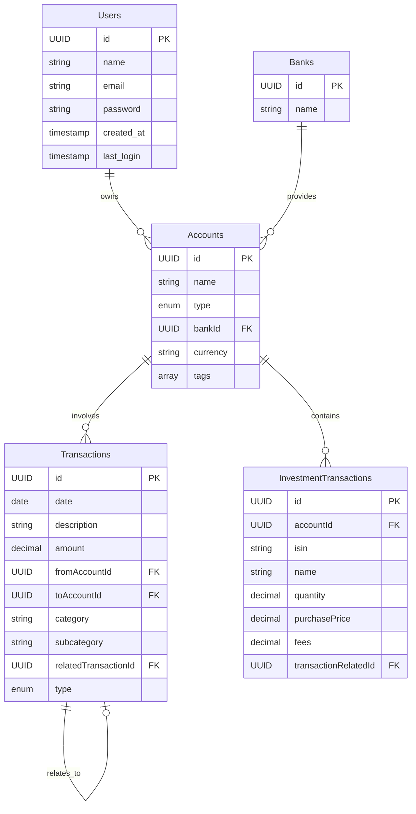

# 📚 Database Structure Documentation

This document outlines the database schema for the WealthManager application. The database is designed to efficiently manage personal financial data while maintaining relationships between different entities.

## 🏗 Schema Overview

### 👤 Users Table
Primary table for user management and authentication.

| Field | Type | Description |
|-------|------|-------------|
| `id` | UUID | Unique identifier for the user |
| `name` | String | User's full name |
| `email` | String | User's email address (unique) |
| `password` | String | Encrypted password hash |
| `created_at` | Timestamp | Account creation date |
| `last_login` | Timestamp | Last login timestamp |

### 🏦 Banks Table
Stores information about financial institutions.

| Field | Type | Description |
|-------|------|-------------|
| `id` | UUID | Unique identifier for the bank |
| `name` | String | Bank's name |

### 💰 Accounts Table
Manages different types of financial accounts.

| Field | Type | Description |
|-------|------|-------------|
| `id` | UUID | Unique identifier for the account |
| `name` | String | Account name |
| `type` | Enum | Account type: asset/investment/income/expense/checking/savings |
| `bankId` | UUID | Reference to associated bank |
| `currency` | String | Account currency code |
| `tags` | Array[String] | Custom tags for account categorization |

### 💸 Transactions Table
Records all financial transactions.

| Field | Type | Description |
|-------|------|-------------|
| `id` | UUID | Unique identifier for the transaction |
| `date` | Date | Transaction date |
| `description` | String | Transaction description |
| `amount` | Decimal | Transaction amount |
| `fromAccountId` | UUID | Source account reference |
| `toAccountId` | UUID | Destination account reference |
| `category` | String | Transaction category |
| `subcategory` | String | Transaction subcategory (optional) |
| `relatedTransactionId` | UUID | Reference to related transaction (optional) |
| `type` | Enum | Transaction type: expense/income/transfer/refund |

### 📈 Investment Transactions Table
Specialized table for investment-related transactions.

| Field | Type | Description |
|-------|------|-------------|
| `id` | UUID | Unique identifier for the investment transaction |
| `accountId` | UUID | Reference to associated asset account |
| `isin` | String | Stock symbol or ETF ticker |
| `name` | String | Investment name |
| `quantity` | Decimal | Number of shares/units |
| `purchasePrice` | Decimal | Price per share/unit |
| `fees` | Decimal | Transaction fees |
| `transactionRelatedId` | UUID | Reference to main transaction (optional) |

## 🔗 Relationships



## 🔐 Data Integrity Rules

## 📊 Views

### account_balances
Provides current balance for each account by calculating the net effect of all transactions.

```sql
CREATE VIEW account_balances AS
WITH transaction_impacts AS (
    -- Incoming transactions (positive impact)
    SELECT 
        to_account_id as account_id,
        CASE 
            WHEN type = 'income' THEN amount
            WHEN type = 'transfer' THEN amount
            ELSE 0 
        END as amount
    FROM transactions
    
    UNION ALL
    
    -- Outgoing transactions (negative impact)
    SELECT 
        from_account_id as account_id,
        CASE 
            WHEN type = 'expense' THEN -amount
            WHEN type = 'transfer' THEN -amount
            ELSE 0 
        END as amount
    FROM transactions
)
SELECT 
    a.id as account_id,
    a.user_id,
    a.name as account_name,
    a.type as account_type,
    a.currency,
    COALESCE(SUM(ti.amount), 0) as current_balance
FROM accounts a
LEFT JOIN transaction_impacts ti ON a.id = ti.account_id
GROUP BY a.id, a.user_id, a.name, a.type, a.currency;
```

This view provides several benefits:
1. **Accurate Balance Calculation**: Properly handles different transaction types (income, expense, transfer)
2. **Performance**: Pre-calculates account balances instead of computing them on every request
3. **Consistency**: Ensures all parts of the application use the same balance calculation logic
4. **Maintainability**: Centralizes the balance calculation logic
