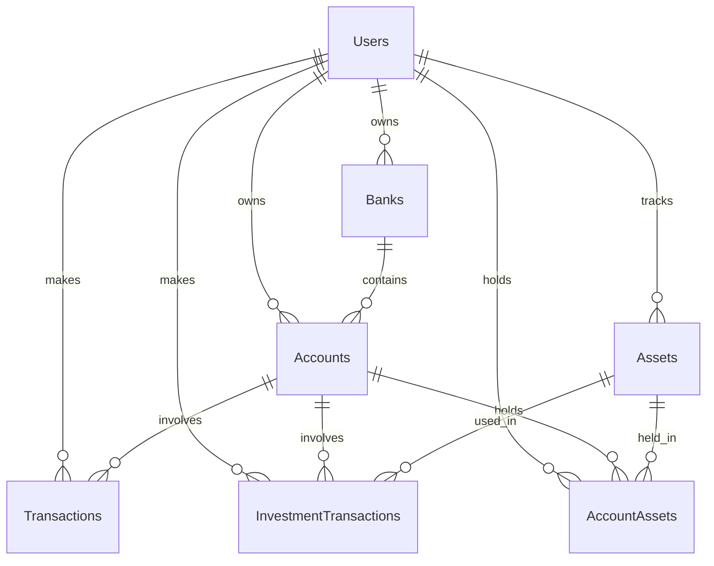

# 📚 Database Structure Documentation

This document outlines the database schema for the WealthManager application. The database is designed to efficiently manage personal financial data while maintaining relationships between different entities.

## 🏗 Schema Overview

### 👤 Users Table
Primary table for user management and authentication.

| Field | Type | Description | Constraints |
|-------|------|-------------|-------------|
| `id` | INTEGER | Unique identifier | PRIMARY KEY, AUTOINCREMENT |
| `name` | TEXT | User's full name | NOT NULL |
| `email` | TEXT | User's email address | UNIQUE, NOT NULL |
| `password` | TEXT | Encrypted password | NOT NULL |
| `last_login` | TIMESTAMP | Last login timestamp | |

### 🏦 Banks Table
Stores information about financial institutions.

| Field | Type | Description | Constraints |
|-------|------|-------------|-------------|
| `id` | INTEGER | Unique identifier | PRIMARY KEY, AUTOINCREMENT |
| `user_id` | INTEGER | Reference to user | FOREIGN KEY, NOT NULL |
| `name` | TEXT | Bank's name | NOT NULL |

### 💰 Accounts Table
Manages different types of financial accounts.

| Field | Type | Description | Constraints |
|-------|------|-------------|-------------|
| `id` | INTEGER | Unique identifier | PRIMARY KEY, AUTOINCREMENT |
| `user_id` | INTEGER | Reference to user | FOREIGN KEY, NOT NULL |
| `name` | TEXT | Account name | NOT NULL |
| `type` | TEXT | Account type | CHECK(type IN ('investment', 'income', 'expense', 'checking', 'savings')), NOT NULL |
| `bank_id` | INTEGER | Reference to bank | FOREIGN KEY, NOT NULL |

### 💸 Transactions Table
Records all financial transactions.

| Field | Type | Description | Constraints |
|-------|------|-------------|-------------|
| `id` | INTEGER | Unique identifier | PRIMARY KEY, AUTOINCREMENT |
| `user_id` | INTEGER | Reference to user | FOREIGN KEY, NOT NULL |
| `date` | TIMESTAMP | Transaction date | NOT NULL |
| `date_accountability` | TIMESTAMP | Accountability date | NOT NULL |
| `description` | TEXT | Transaction description | NOT NULL |
| `amount` | DECIMAL(10,2) | Transaction amount | NOT NULL |
| `from_account_id` | INTEGER | Source account | FOREIGN KEY, NOT NULL |
| `to_account_id` | INTEGER | Destination account | FOREIGN KEY, NOT NULL |
| `category` | TEXT | Transaction category | NOT NULL |
| `subcategory` | TEXT | Transaction subcategory | |
| `type` | TEXT | Transaction type | CHECK(type IN ('expense', 'income', 'transfer')), NOT NULL |

### 📈 Assets Table
Stores information about investment assets.

| Field | Type | Description | Constraints |
|-------|------|-------------|-------------|
| `id` | INTEGER | Unique identifier | PRIMARY KEY, AUTOINCREMENT |
| `user_id` | INTEGER | Reference to user | FOREIGN KEY, NOT NULL |
| `symbol` | TEXT | Asset symbol | UNIQUE, NOT NULL |
| `name` | TEXT | Asset name | NOT NULL |

### 💹 Investment Transactions Table
Records investment-related transactions.

| Field | Type | Description | Constraints |
|-------|------|-------------|-------------|
| `id` | INTEGER | Unique identifier | PRIMARY KEY, AUTOINCREMENT |
| `user_id` | INTEGER | Reference to user | FOREIGN KEY, NOT NULL |
| `from_account_id` | INTEGER | Source account | FOREIGN KEY, NOT NULL |
| `to_account_id` | INTEGER | Destination account | FOREIGN KEY, NOT NULL |
| `asset_id` | INTEGER | Reference to asset | FOREIGN KEY, NOT NULL |
| `activity_type` | TEXT | Type of activity | CHECK(activity_type IN ('buy', 'sell', 'deposit', 'withdrawal')), NOT NULL |
| `date` | TIMESTAMP | Transaction date | NOT NULL |
| `quantity` | DECIMAL(10,6) | Number of units | NOT NULL |
| `unit_price` | DECIMAL(10,2) | Price per unit | NOT NULL |
| `fee` | DECIMAL(10,2) | Transaction fee | NOT NULL |
| `tax` | DECIMAL(10,2) | Transaction tax | NOT NULL |
| `total_paid` | DECIMAL(10,2) | Total amount paid | |

### 📊 Account Assets Table
Tracks asset holdings in accounts.

| Field | Type | Description | Constraints |
|-------|------|-------------|-------------|
| `id` | INTEGER | Unique identifier | PRIMARY KEY, AUTOINCREMENT |
| `user_id` | INTEGER | Reference to user | FOREIGN KEY, NOT NULL |
| `account_id` | INTEGER | Reference to account | FOREIGN KEY, NOT NULL |
| `asset_id` | INTEGER | Reference to asset | FOREIGN KEY, NOT NULL |
| `quantity` | DECIMAL(10,6) | Number of units held | NOT NULL |

## 📊 Views

### account_balances
Calculates current balance for each account based on all transactions.

This view:
- Combines incoming and outgoing transactions for each account
- Handles different transaction types (income, expense, transfer)
- Returns current balance by summing all transaction impacts
- Includes account metadata (name, type, user_id)

```sql
WITH transaction_impacts AS (
    -- Incoming transactions (positive impact)
    SELECT
        to_account_id as account_id,
        CASE
            WHEN type = 'income' THEN amount
            WHEN type = 'transfer' THEN amount
            ELSE 0
        END as amount
    FROM transactions
    UNION ALL
    -- Outgoing transactions (negative impact)
    SELECT
        from_account_id as account_id,
        CASE
            WHEN type = 'expense' THEN -amount
            WHEN type = 'transfer' THEN -amount
            ELSE 0
        END as amount
    FROM transactions
)
SELECT
    a.id as account_id,
    a.user_id,
    a.name as account_name,
    a.type as account_type,
    COALESCE(SUM(ti.amount), 0) as current_balance
FROM accounts a
LEFT JOIN transaction_impacts ti ON a.id = ti.account_id
GROUP BY a.id, a.user_id, a.name, a.type
```

## 🔫 Triggers

### trg_validate_transaction
Validates transaction types and account combinations before insertion.

This trigger ensures:
- Income transactions:
  - Can only be received in checking, savings, or investment accounts
  - Must originate from an income account
- Expense transactions:
  - Can only be paid from checking, savings, or investment accounts
  - Must go to an expense account
- Transfer transactions:
  - Can only occur between checking, savings, or investment accounts

### trg_calculate_total_paid_investment_transaction
Automatically calculates the total amount paid for investment transactions.

This trigger:
- Fires after INSERT on investment_transactions
- Calculates total_paid as: (quantity × unit_price) + fee + tax
- Updates the record with the calculated total

### trg_calculate_total_paid_investment_transaction_update
Similar to above, but fires after UPDATE operations to maintain accuracy.

## 🔗 Entity Relationships



## 🔐 Data Integrity

1. **Foreign Key Constraints**
   - All relationships are enforced with ON DELETE CASCADE
   - Ensures referential integrity across all tables

2. **Type Validations**
   - Account types: 'investment', 'income', 'expense', 'checking', 'savings'
   - Transaction types: 'expense', 'income', 'transfer'
   - Investment activity types: 'buy', 'sell', 'deposit', 'withdrawal'

3. **Triggers**
   - Validates transaction types and account combinations
   - Automatically calculates total_paid for investment transactions
   - Updates account balances based on transactions

4. **Indexes**
   - Optimized queries for user-related operations
   - Efficient lookups for transactions and investments
   - Performance-oriented index structure for common operations
