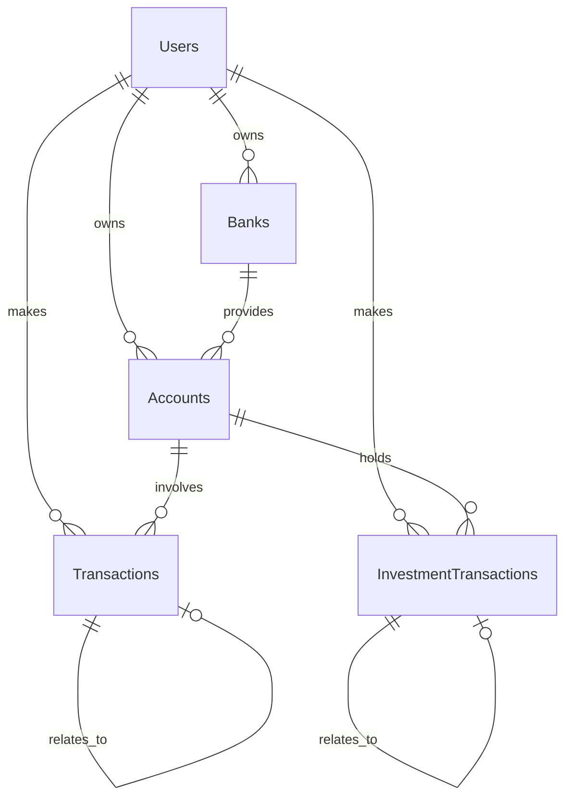

# 📚 Database Structure Documentation

This document outlines the database schema for the WealthManager application. The database is designed to efficiently manage personal financial data while maintaining relationships between different entities.

## 🏗 Schema Overview

### 👤 Users Table
Primary table for user management and authentication.

| Field | Type | Description | Constraints |
|-------|------|-------------|-------------|
| `id` | INTEGER | Unique identifier | PRIMARY KEY, AUTOINCREMENT |
| `name` | TEXT | User's full name | NOT NULL |
| `email` | TEXT | User's email address | UNIQUE, NOT NULL |
| `password` | TEXT | Encrypted password | NOT NULL |
| `last_login` | TIMESTAMP | Last login timestamp | |

### 🏦 Banks Table
Stores information about financial institutions.

| Field | Type | Description | Constraints |
|-------|------|-------------|-------------|
| `id` | INTEGER | Unique identifier | PRIMARY KEY, AUTOINCREMENT |
| `user_id` | INTEGER | Reference to user | FOREIGN KEY, NOT NULL |
| `name` | TEXT | Bank's name | NOT NULL |

### 💰 Accounts Table
Manages different types of financial accounts.

| Field | Type | Description | Constraints |
|-------|------|-------------|-------------|
| `id` | INTEGER | Unique identifier | PRIMARY KEY, AUTOINCREMENT |
| `user_id` | INTEGER | Reference to user | FOREIGN KEY, NOT NULL |
| `name` | TEXT | Account name | NOT NULL |
| `type` | TEXT | Account type | CHECK(type IN ('investment', 'income', 'expense', 'checking', 'savings')), NOT NULL |
| `bank_id` | INTEGER | Reference to bank | FOREIGN KEY, NOT NULL |
| `currency` | TEXT | Currency code | NOT NULL |
| `tags` | TEXT | Custom tags | |

### 💸 Transactions Table
Records all financial transactions.

| Field | Type | Description | Constraints |
|-------|------|-------------|-------------|
| `id` | INTEGER | Unique identifier | PRIMARY KEY, AUTOINCREMENT |
| `user_id` | INTEGER | Reference to user | FOREIGN KEY, NOT NULL |
| `date` | TIMESTAMP | Transaction date | NOT NULL |
| `date_accountability` | TIMESTAMP | Accountability date | NOT NULL |
| `description` | TEXT | Transaction description | NOT NULL |
| `amount` | DECIMAL(10,2) | Transaction amount | NOT NULL |
| `from_account_id` | INTEGER | Source account | FOREIGN KEY, NOT NULL |
| `to_account_id` | INTEGER | Destination account | FOREIGN KEY, NOT NULL |
| `category` | TEXT | Transaction category | |
| `subcategory` | TEXT | Transaction subcategory | |
| `related_transaction_id` | INTEGER | Related transaction | |
| `type` | TEXT | Transaction type | CHECK(type IN ('expense', 'income', 'transfer')), NOT NULL |

### 📈 Investment Transactions Table
Specialized table for investment-related transactions.

| Field | Type | Description | Constraints |
|-------|------|-------------|-------------|
| `id` | INTEGER | Unique identifier | PRIMARY KEY, AUTOINCREMENT |
| `user_id` | INTEGER | Reference to user | FOREIGN KEY, NOT NULL |
| `account_id` | INTEGER | Reference to account | FOREIGN KEY, NOT NULL |
| `asset_symbol` | TEXT | Stock/ETF symbol | NOT NULL |
| `asset_name` | TEXT | Investment name | NOT NULL |
| `activity_type` | TEXT | Type of activity | CHECK(activity_type IN ('buy', 'sell', 'deposit', 'withdrawal')), NOT NULL |
| `date` | TIMESTAMP | Transaction date | NOT NULL |
| `quantity` | DECIMAL(10,6) | Number of shares | NOT NULL |
| `unit_price` | DECIMAL(10,2) | Price per share | NOT NULL |
| `fee` | DECIMAL(10,2) | Transaction fee | NOT NULL |
| `tax` | DECIMAL(10,2) | Transaction tax | NOT NULL |
| `transaction_related_id` | INTEGER | Related transaction | FOREIGN KEY |

## 🔗 Entity Relationships



## 📊 Views

### account_balances
Provides current balance for each account by calculating the net effect of all transactions.

```sql
CREATE VIEW account_balances AS
WITH transaction_impacts AS (
    -- Incoming transactions (positive impact)
    SELECT 
        to_account_id as account_id,
        CASE 
            WHEN type = 'income' THEN amount
            WHEN type = 'transfer' THEN amount
            ELSE 0 
        END as amount
    FROM transactions
    
    UNION ALL
    
    -- Outgoing transactions (negative impact)
    SELECT 
        from_account_id as account_id,
        CASE 
            WHEN type = 'expense' THEN -amount
            WHEN type = 'transfer' THEN -amount
            ELSE 0 
        END as amount
    FROM transactions
)
SELECT 
    a.id as account_id,
    a.user_id,
    a.name as account_name,
    a.type as account_type,
    a.currency,
    COALESCE(SUM(ti.amount), 0) as current_balance
FROM accounts a
LEFT JOIN transaction_impacts ti ON a.id = ti.account_id
GROUP BY a.id, a.user_id, a.name, a.type, a.currency;
```

## 🔐 Data Integrity Rules

1. **Referential Integrity**
   - All foreign keys are enforced with CASCADE delete
   - User deletion cascades to all related records
   - Account deletion checks for transaction dependencies

2. **Type Constraints**
   - Account types are restricted to predefined values
   - Transaction types are restricted to predefined values
   - Investment activity types are restricted to predefined values

3. **Required Fields**
   - Critical fields are marked as NOT NULL
   - Unique constraints on email addresses
   - Monetary values use DECIMAL for precision

4. **Date Handling**
   - All dates stored as TIMESTAMP
   - Accountability date tracks when transaction should be counted
   - Last login tracked for security purposes
