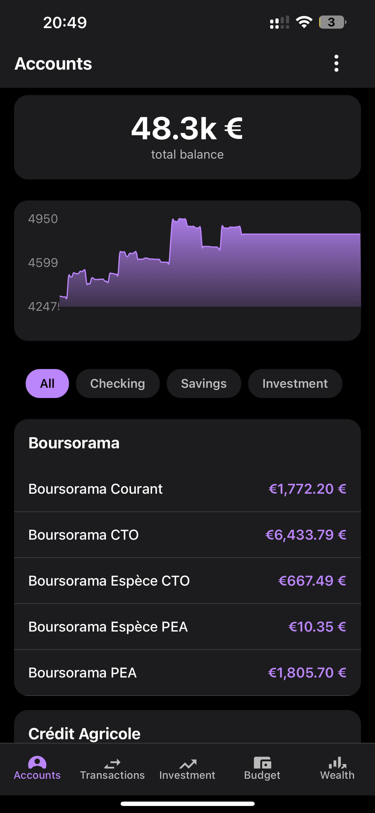
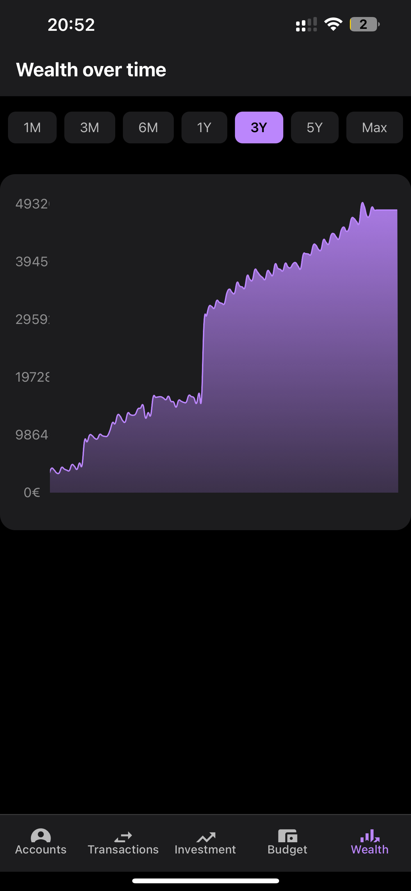
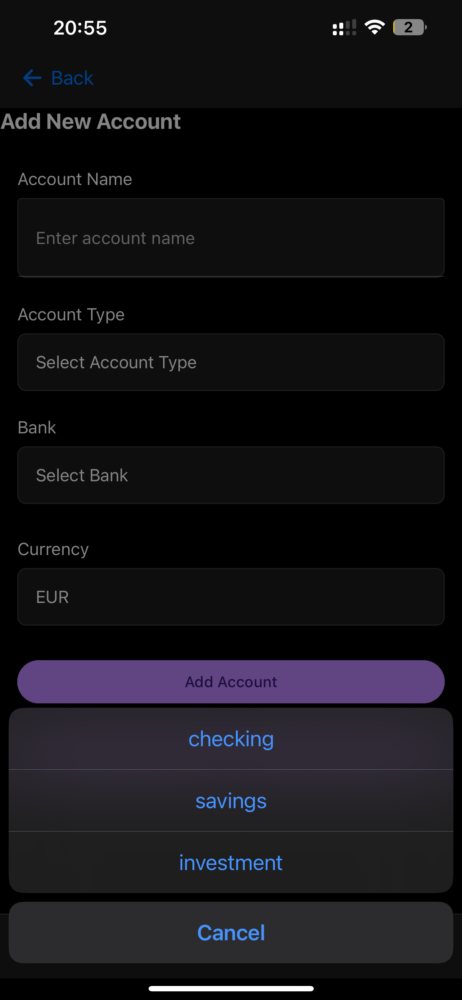
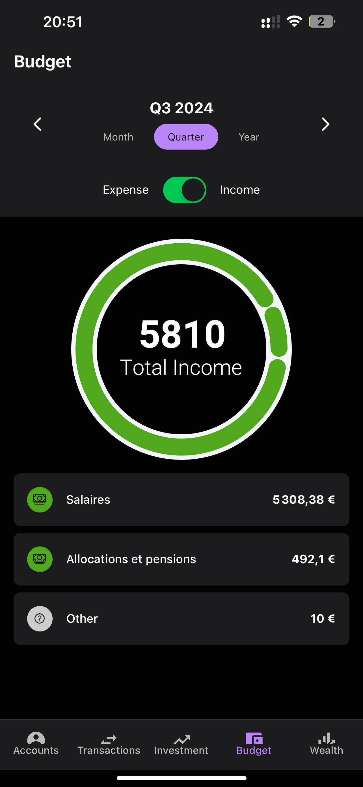
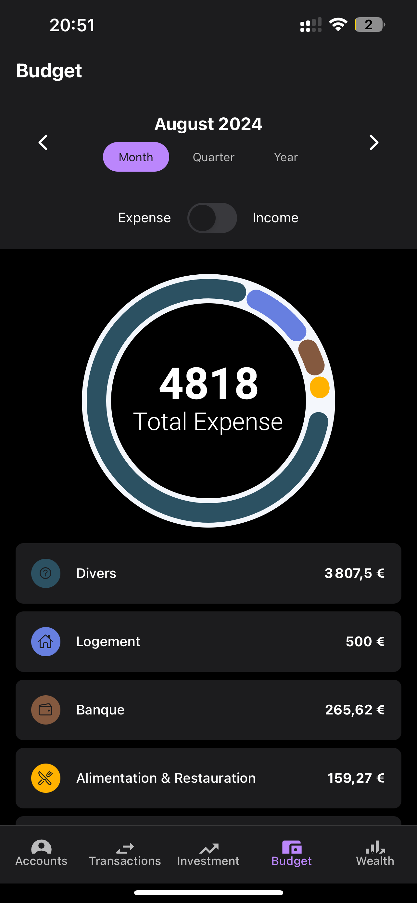
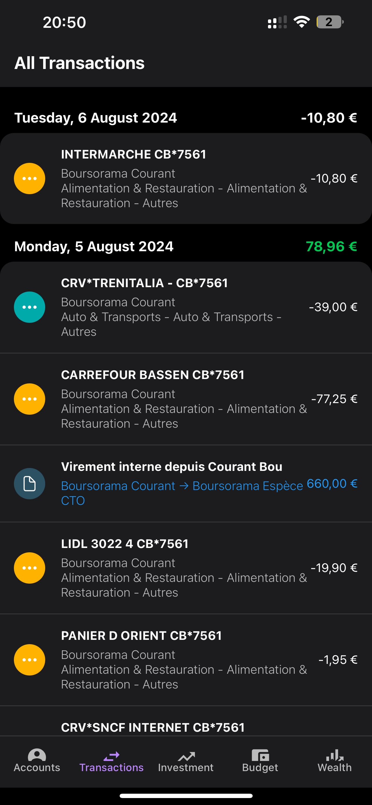

# Wealth Manager Mobile App 🚀

A cross-platform **React Native** app built with **Expo** and **expo-router**. Track accounts, budgets, investments, and transactions with charts and a workflow tuned for phones and tablets.

<p align="center">
  
</p>

> **Note:** This package (`wealth_manager`) is **not** part of the Bun workspaces in the repo root. Install dependencies **inside `frontend/`** (npm or Bun—see `package.json`).

## ✨ Key Features

### 📊 Real-Time Wealth Tracking

- Interactive wealth evolution charts
- Multi-currency support
- Customizable ranges (1M, 3M, 6M, 1Y, 3Y, 5Y, Max)



### 💰 Smart Account Management

- Multiple account types (checking, savings, investment)
- Bank connectivity (where supported by the stack)
- Balance and transaction history



### 📈 Budget Analytics

- Donut and breakdown views for spending
- Custom budget periods
- Income vs expense views




### 🔄 Transaction Management

- Add and edit transactions
- Categories and transfers between accounts



### 🎨 UI

- Dark mode
- **Expo Router** navigation
- **React Native Paper** and **React Native Elements**


## 🛠 Technical Stack

| Area       | Technology                                                    |
| ---------- | ------------------------------------------------------------- |
| Framework  | Expo **52**, React **18**, React Native **0.76**              |
| Navigation | **expo-router**                                               |
| State      | Redux + thunk                                                 |
| HTTP       | **Axios** (`app/api/axiosConfig.ts`)                          |
| Auth       | JWT (tokens from the backend)                                 |
| Charts     | react-native-gifted-charts, **@shopify/react-native-skia**    |
| Web        | **react-native-web** (Expo web / static export)               |
| Quality    | Jest (`jest-expo`), ESLint via `expo lint`, optional **Knip** |

## 🔗 Backend URL

The API base URL is defined in **`config.ts`** (default `http://localhost:5000`). Change it there—or extend the app to read from `expo-constants` / env—when pointing at a deployed API.

## 🚀 Getting Started

```bash
cd frontend
npm install
npm run start
# or: npm run web   → Expo for web
# or: npm run ios | npm run android
```

- **iOS simulator:** press `i` in the CLI (macOS + Xcode).
- **Android emulator:** press `a`.
- **Physical device:** scan the QR code with **Expo Go** (same major SDK as the project).

## 📱 Platform Support

- iOS
- Android
- Web (Expo web / exported static bundle for GitHub Pages—see `deploy` scripts)

## 📜 Scripts (see `package.json`)

| Script                            | Description                                     |
| --------------------------------- | ----------------------------------------------- |
| `npm run start`                   | `expo start`                                    |
| `npm run web`                     | `expo start --web`                              |
| `npm run android` / `npm run ios` | Platform dev clients                            |
| `npm run test`                    | Jest watch                                      |
| `npm run lint`                    | `expo lint`                                     |
| `npm run predeploy` / `deploy`    | `expo export:web` + **gh-pages** to `web-build` |

## 🔒 Security

- JWT access/refresh flow against the backend
- Use HTTPS in production; keep tokens out of logs and screenshots shared publicly

## 🤝 Contributing

Contributions are welcome via pull requests. Align API usage with [backend/README.md](../backend/README.md).

## 📄 License

This project is licensed under the MIT License—see the [LICENSE](../LICENSE) file in the repository root.
